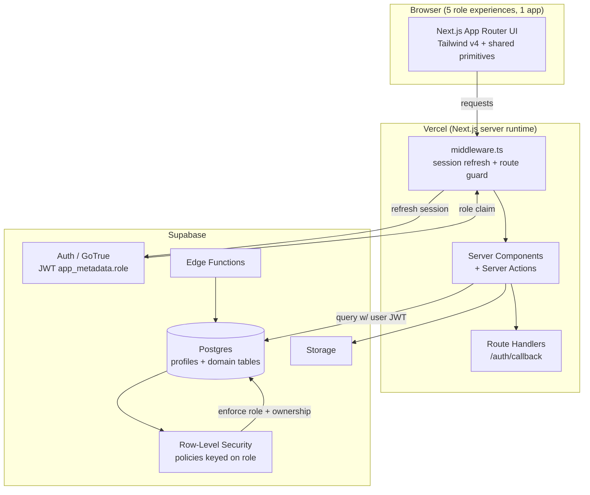
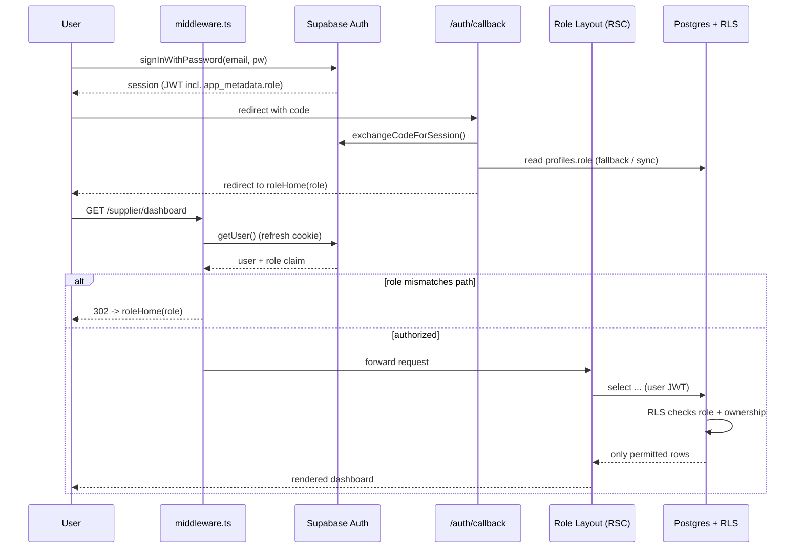
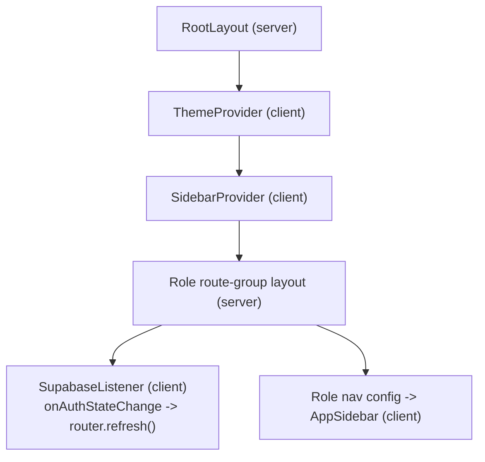
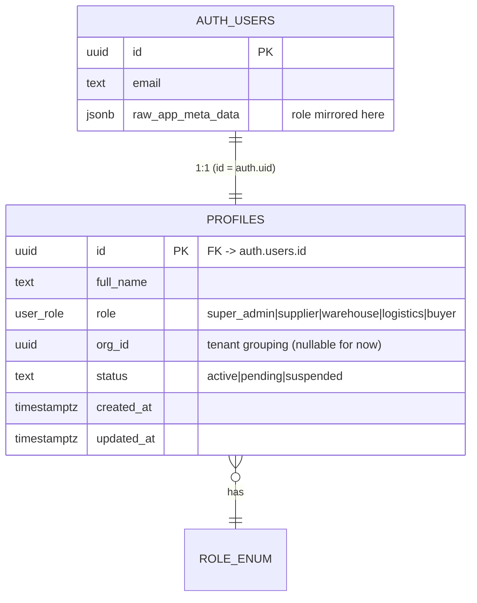

# Design Document: Platform Foundation

## Overview

This document is the **infrastructure / architecture master plan** for a scalable B2B trade and logistics platform built on top of the existing TailAdmin Next.js admin template. It defines the foundation layer that all five role dashboards (Super Admin/CEO, Supplier, Warehouse, Logistics/Driver, B2B Buyer) will build on. It does **not** define the feature pages of individual roles — those are separate specs that follow.

The platform repurposes a single Next.js 15 (App Router) + Tailwind v4 + TypeScript codebase. Each role lives in its own App Router route group with its own layout, navigation config, and feature folder, while sharing a common set of UI primitives carried forward from the template. Authentication, authorization, and data isolation are handled by **Supabase** (Auth, Postgres, Row-Level Security, Edge Functions) with role information stored in a `profiles` table and mirrored into the JWT `app_metadata`. **Vercel** hosts the app with full SSR, middleware, and server-action support.

The single most important migration this foundation requires is removing the template's static-export configuration (`output: 'export'`). The current config produces a fully static site with no SSR, no API routes, no server actions, and no middleware — none of which is compatible with Supabase server-side auth and role-based middleware redirects. This plan treats that migration as step zero.

The four areas the architecture must answer are addressed in dedicated sections:
1. Scalable Directory Structure (multi-role layout) — see *Directory Architecture*.
2. Multi-Role Authentication Routing (Supabase + middleware + RLS) — see *Authentication & Authorization Architecture* and *Low-Level Design*.
3. Vercel & Environment Setup — see *Deployment & Environment Architecture*.
4. Template Cleaning — see *Template Cleanup Plan*.

---

## High-Level Design

### Static-Export → Vercel SSR Migration (Step Zero)

The template ships with this `next.config.ts`:

```ts
output: 'export',          // static HTML export — NO SSR, NO middleware, NO API routes
trailingSlash: true,       // GitHub Pages friendliness
basePath: '/tailadmin-nextjs',
assetPrefix: '/tailadmin-nextjs',
images: { unoptimized: true },
```

This is fundamentally incompatible with the target architecture. Supabase server-side auth (`@supabase/ssr`), Next.js `middleware.ts` route protection, and role-based redirects all require a Node/edge server runtime that static export does not provide.

**Required migration:**

```ts
// next.config.ts (target)
import type { NextConfig } from "next";

const nextConfig: NextConfig = {
  // output: 'export' REMOVED — Vercel runs the full Next.js server runtime
  // trailingSlash REMOVED — middleware matchers and redirects assume canonical paths
  // basePath / assetPrefix REMOVED — app is served from domain root on Vercel
  images: {
    // unoptimized:true can be dropped; Vercel provides the Image Optimization service.
    // Add remotePatterns for Supabase Storage if product/avatar images are served from it.
    remotePatterns: [
      { protocol: "https", hostname: "*.supabase.co" },
    ],
  },
  webpack(config) {
    config.module.rules.push({ test: /\.svg$/, use: ["@svgr/webpack"] });
    return config;
  },
};

export default nextConfig;
```

Also delete `.github/workflows/deploy.yml` (GitHub Pages deploy) — Vercel's Git integration replaces it.

## Architecture

### System Context



### Role → Route Mapping

| Role (profiles.role) | Route group | Base path | Landing route |
|---|---|---|---|
| `super_admin` | `(admin)` | `/admin` | `/admin/dashboard` |
| `supplier` | `(supplier)` | `/supplier` | `/supplier/dashboard` |
| `warehouse` | `(warehouse)` | `/warehouse` | `/warehouse/dashboard` |
| `logistics` | `(logistics)` | `/logistics` | `/logistics/dashboard` |
| `buyer` | `(buyer)` | `/buyer` | `/buyer/dashboard` |

Route groups (parentheses) keep each role's files isolated and let each have its own `layout.tsx` (own sidebar/header/nav config) **without** adding a segment to the URL. The actual URL segment (`/admin`, `/supplier`, …) comes from a nested folder inside the group, so a role's code never mixes with another's.

### Authentication & Authorization Architecture

Three layers of defense, each independent:

1. **Edge middleware (`middleware.ts`)** — runs on every matched request. Refreshes the Supabase session cookie and performs a coarse-grained guard: unauthenticated users hitting a protected role path are redirected to `/signin`; authenticated users are kept inside the route group that matches their role.
2. **Server Components / Server Actions** — re-validate the user with `supabase.auth.getUser()` (never trust `getSession()` alone server-side) and read the role claim before rendering or mutating.
3. **Row-Level Security (Postgres)** — the ultimate authority. Even if app code is bypassed, RLS policies keyed on `auth.jwt() -> app_metadata -> role` and ownership columns prevent cross-role/cross-tenant data access.



### Provider Tree (Server-Auth Aware)

The current tree is `RootLayout -> ThemeProvider -> SidebarProvider`. We keep theme/sidebar contexts (client-only UI state) and add an auth boundary fed by the server.



`ThemeProvider` and `SidebarProvider` stay as-is (they manage `localStorage` + the `dark` class and sidebar expand/collapse). Server-fetched user + role are passed down as props from the role layout; a small client `SupabaseListener` subscribes to `onAuthStateChange` to keep client and server cookies in sync via `router.refresh()`.

## Data Models

### Data Model



`profiles` is the source of truth for role. The role is also mirrored into the JWT `app_metadata.role` (via an admin update / Edge Function) so middleware and RLS can read it without an extra DB round-trip. `app_metadata` is server-controlled and not editable by the end user, which is why it is safe for authorization (unlike `user_metadata`).

## Components and Interfaces

### Components and Interfaces

#### Supabase client factory (three contexts)

`@supabase/ssr` requires a different client per execution context because each reads/writes cookies differently.

```ts
// src/lib/supabase/types.ts
export type UserRole =
  | "super_admin" | "supplier" | "warehouse" | "logistics" | "buyer";

export interface SessionUser {
  id: string;
  email: string | null;
  role: UserRole | null;
}
```

| Client | File | Used in | Purpose |
|---|---|---|---|
| Browser client | `src/lib/supabase/client.ts` | Client Components | interactive auth, realtime, client queries |
| Server client | `src/lib/supabase/server.ts` | Server Components, Server Actions, Route Handlers | cookie-bound server reads/writes |
| Middleware client | `src/lib/supabase/middleware.ts` | `middleware.ts` | session refresh + cookie propagation |

#### Role configuration registry

A single config maps each role to its base path, landing route, and nav items — this is what makes the sidebar **config-driven** instead of hardcoded.

```ts
// src/config/roles.ts
export interface NavItem {
  label: string;
  href: string;
  icon: string;            // key into the existing src/icons set
  children?: NavItem[];
}

export interface RoleConfig {
  role: UserRole;
  basePath: string;        // "/supplier"
  home: string;            // "/supplier/dashboard"
  label: string;           // "Supplier Portal"
  nav: NavItem[];          // drives AppSidebar
}

export const ROLE_CONFIG: Record<UserRole, RoleConfig>;
export function roleHome(role: UserRole): string;
export function basePathForRole(role: UserRole): string;
export function roleForPath(pathname: string): UserRole | null;
```

### Deployment & Environment Architecture

Vercel project connected to the Git repo. Environment variables are set per-environment (Development / Preview / Production) in the Vercel dashboard and mirrored locally in `.env.local`.

| Variable | Exposure | Purpose |
|---|---|---|
| `NEXT_PUBLIC_SUPABASE_URL` | public (browser + server) | Supabase project URL |
| `NEXT_PUBLIC_SUPABASE_ANON_KEY` | public (browser + server) | anon key; safe with RLS enabled |
| `SUPABASE_SERVICE_ROLE_KEY` | **server-only** | bypasses RLS; admin tasks, role syncing, Edge Functions. Never `NEXT_PUBLIC_`. |
| `NEXT_PUBLIC_SITE_URL` | public | canonical site URL for auth redirect/callback |

**Security note:** `NEXT_PUBLIC_*` variables are inlined into the client bundle and are visible to anyone. The anon key is designed to be public **only because RLS is the real guard** — RLS must be enabled on every table before launch. `SUPABASE_SERVICE_ROLE_KEY` must never be prefixed with `NEXT_PUBLIC_` and must only be referenced in server-only modules (Server Actions, Route Handlers, Edge Functions).

### Template Cleanup Plan

The platform must be cleaned of the e-commerce/demo content while preserving reusable primitives.

**DELETE (demo content, not reusable):**
- `src/app/(admin)/(ui-elements)/` — entire showcase tree (alerts, avatars, badge, buttons, images, modals, videos pages).
- `src/app/(admin)/(others-pages)/(chart)/`, `(forms)/`, `(tables)/`, `blank/`, `calendar/`, `profile/` demo pages.
- `src/app/(admin)/page.tsx` — e-commerce dashboard home.
- `src/components/ecommerce/` — sales/orders/demographics/country-map widgets.
- `src/components/example/` — modal examples.
- `.github/workflows/deploy.yml` — GitHub Pages workflow.
- Demo-only assets under `public/images/` (carousel, cards, country, product) once confirmed unreferenced.

**KEEP as reusable primitives (carry forward unchanged):**
- `src/components/ui/*` (button, badge, modal, table, dropdown, alert, avatar, images, video).
- `src/components/form/*` (inputs, select, switch, date-picker, label, group-input).
- `src/components/common/*` (ComponentCard, PageBreadCrumb, theme togglers, GridShape).
- `src/components/footer/Footer.tsx`, `src/components/header/*`.
- `src/context/ThemeContext.tsx`, `src/context/SidebarContext.tsx`.
- `src/icons/*`, `src/hooks/*`, `src/lib/utils/*`.

**REFACTOR (keep but rework for multi-role):**
- `src/layout/AppSidebar.tsx` — replace the hardcoded `navItems`/`othersItems` arrays with a prop/config-driven render that consumes `ROLE_CONFIG[role].nav`.
- `src/app/(admin)/layout.tsx` shell pattern — generalize into a reusable role-shell so each new route group reuses the same `AppSidebar + AppHeader + Footer` skeleton with its own nav config.
- `src/components/auth/SignInForm.tsx` / `SignUpForm.tsx` — wire to Supabase Auth (currently static).
- Branding (README "CryptoFlow", logos in `public/images/logo`) — replace with platform branding.

---

## Directory Architecture

Concrete target tree (feature-based, per-role isolation, shared core):

```text
src/
├── middleware.ts                      # edge auth guard + session refresh (NEW, root of src)
├── app/
│   ├── layout.tsx                     # RootLayout -> Theme -> Sidebar (kept)
│   ├── globals.css
│   ├── not-found.tsx
│   │
│   ├── (auth)/                        # full-width auth pages (no dashboard shell)
│   │   ├── layout.tsx
│   │   ├── signin/page.tsx
│   │   └── signup/page.tsx
│   │
│   ├── auth/
│   │   └── callback/route.ts          # Route Handler: exchangeCodeForSession + role redirect
│   │
│   ├── (admin)/                       # ROLE: super_admin
│   │   ├── layout.tsx                 # role shell, nav = ROLE_CONFIG.super_admin
│   │   └── admin/
│   │       ├── dashboard/page.tsx
│   │       └── ...                    # admin features (later specs)
│   │
│   ├── (supplier)/                    # ROLE: supplier
│   │   ├── layout.tsx
│   │   └── supplier/
│   │       └── dashboard/page.tsx
│   │
│   ├── (warehouse)/                   # ROLE: warehouse
│   │   ├── layout.tsx
│   │   └── warehouse/
│   │       └── dashboard/page.tsx
│   │
│   ├── (logistics)/                   # ROLE: logistics
│   │   ├── layout.tsx
│   │   └── logistics/
│   │       └── dashboard/page.tsx
│   │
│   └── (buyer)/                       # ROLE: buyer
│       ├── layout.tsx
│       └── buyer/
│           └── dashboard/page.tsx
│
├── features/                          # feature-based domain logic per role (NEW)
│   ├── admin/        { components/  actions/  queries/  types.ts }
│   ├── supplier/     { components/  actions/  queries/  types.ts }
│   ├── warehouse/    { ... }
│   ├── logistics/    { ... }
│   └── buyer/        { ... }
│
├── components/                        # SHARED, role-agnostic
│   ├── ui/                            # kept primitives
│   ├── form/                          # kept primitives
│   ├── common/                        # kept primitives
│   ├── header/
│   └── footer/
│
├── layout/
│   ├── AppSidebar.tsx                 # refactored: config-driven nav
│   ├── AppHeader.tsx
│   ├── Backdrop.tsx
│   └── RoleShell.tsx                  # NEW: shared shell wrapping the 5 layouts
│
├── config/
│   └── roles.ts                       # ROLE_CONFIG registry + helpers (NEW)
│
├── context/
│   ├── ThemeContext.tsx               # kept
│   └── SidebarContext.tsx             # kept
│
├── lib/
│   ├── supabase/
│   │   ├── client.ts                  # browser client (NEW)
│   │   ├── server.ts                  # server client (NEW)
│   │   ├── middleware.ts              # middleware client (NEW)
│   │   └── types.ts                   # UserRole, SessionUser (NEW)
│   ├── auth/
│   │   └── getSessionUser.ts          # server helper: user + role (NEW)
│   └── utils/
│
├── hooks/
└── icons/

supabase/                              # repo-tracked DB as code (NEW)
├── migrations/                        # profiles table, enum, RLS policies
└── functions/                         # Edge Functions (e.g., sync-role-claim)
```

**Why this structure:**
- **Route groups per role** give each role its own `layout.tsx` (own sidebar config, own shell) with zero URL pollution and zero file mixing.
- **`features/<role>/`** holds domain components/actions/queries so business logic is colocated by role and never imported across roles — enforceable later with an ESLint boundary rule.
- **`components/` stays shared and role-agnostic** — the reused TailAdmin primitives live here and are the only cross-cutting UI.
- **`config/roles.ts`** is the single source that drives navigation and redirects, replacing hardcoded arrays.
- **`supabase/`** keeps schema and policies as version-controlled migrations, so RLS is reviewable and reproducible.

---

## Low-Level Design

Code is TypeScript (the project's declared language). SQL is used for schema and RLS policies.

### 1. Supabase Clients (`@supabase/ssr`)

```ts
// src/lib/supabase/client.ts — Browser client (Client Components)
import { createBrowserClient } from "@supabase/ssr";

export function createClient() {
  return createBrowserClient(
    process.env.NEXT_PUBLIC_SUPABASE_URL!,
    process.env.NEXT_PUBLIC_SUPABASE_ANON_KEY!,
  );
}
```

```ts
// src/lib/supabase/server.ts — Server client (RSC, Server Actions, Route Handlers)
import { createServerClient } from "@supabase/ssr";
import { cookies } from "next/headers";

export async function createClient() {
  const cookieStore = await cookies();
  return createServerClient(
    process.env.NEXT_PUBLIC_SUPABASE_URL!,
    process.env.NEXT_PUBLIC_SUPABASE_ANON_KEY!,
    {
      cookies: {
        getAll() {
          return cookieStore.getAll();
        },
        setAll(cookiesToSet) {
          try {
            cookiesToSet.forEach(({ name, value, options }) =>
              cookieStore.set(name, value, options),
            );
          } catch {
            // called from a Server Component render: safe to ignore,
            // middleware will refresh the session cookie instead.
          }
        },
      },
    },
  );
}
```

```ts
// src/lib/supabase/middleware.ts — Middleware client + session refresh
import { createServerClient } from "@supabase/ssr";
import { NextResponse, type NextRequest } from "next/server";

export async function updateSession(request: NextRequest) {
  let response = NextResponse.next({ request });

  const supabase = createServerClient(
    process.env.NEXT_PUBLIC_SUPABASE_URL!,
    process.env.NEXT_PUBLIC_SUPABASE_ANON_KEY!,
    {
      cookies: {
        getAll() {
          return request.cookies.getAll();
        },
        setAll(cookiesToSet) {
          cookiesToSet.forEach(({ name, value }) =>
            request.cookies.set(name, value),
          );
          response = NextResponse.next({ request });
          cookiesToSet.forEach(({ name, value, options }) =>
            response.cookies.set(name, value, options),
          );
        },
      },
    },
  );

  // IMPORTANT: getUser() (not getSession()) revalidates the token with Supabase.
  const { data: { user } } = await supabase.auth.getUser();
  return { response, supabase, user };
}
```

### 2. Role Registry (`src/config/roles.ts`)

```ts
import type { UserRole } from "@/lib/supabase/types";

export interface NavItem { label: string; href: string; icon: string; children?: NavItem[]; }
export interface RoleConfig {
  role: UserRole; basePath: string; home: string; label: string; nav: NavItem[];
}

export const ROLE_CONFIG: Record<UserRole, RoleConfig> = {
  super_admin: { role: "super_admin", basePath: "/admin",     home: "/admin/dashboard",     label: "Command Center", nav: [/* ... */] },
  supplier:    { role: "supplier",    basePath: "/supplier",  home: "/supplier/dashboard",  label: "Supplier Portal", nav: [/* ... */] },
  warehouse:   { role: "warehouse",   basePath: "/warehouse", home: "/warehouse/dashboard", label: "Warehouse",       nav: [/* ... */] },
  logistics:   { role: "logistics",   basePath: "/logistics", home: "/logistics/dashboard", label: "Logistics",       nav: [/* ... */] },
  buyer:       { role: "buyer",       basePath: "/buyer",     home: "/buyer/dashboard",     label: "Marketplace",     nav: [/* ... */] },
};

export function roleHome(role: UserRole): string {
  return ROLE_CONFIG[role].home;
}

export function roleForPath(pathname: string): UserRole | null {
  const match = Object.values(ROLE_CONFIG).find((c) =>
    pathname === c.basePath || pathname.startsWith(c.basePath + "/"),
  );
  return match ? match.role : null;
}
```

### 3. Middleware Route Guard (`src/middleware.ts`)

```ts
import { NextResponse, type NextRequest } from "next/server";
import { updateSession } from "@/lib/supabase/middleware";
import { roleForPath, roleHome, ROLE_CONFIG } from "@/config/roles";
import type { UserRole } from "@/lib/supabase/types";

const PUBLIC_PATHS = ["/signin", "/signup", "/auth/callback"];

export async function middleware(request: NextRequest) {
  const { response, user } = await updateSession(request);
  const { pathname } = request.nextUrl;

  const isPublic = PUBLIC_PATHS.some((p) => pathname.startsWith(p));
  const requiredRoleZone = roleForPath(pathname); // role this path belongs to, or null

  // 1. Unauthenticated -> only public paths allowed
  if (!user) {
    if (isPublic) return response;
    const url = request.nextUrl.clone();
    url.pathname = "/signin";
    url.searchParams.set("redirectTo", pathname);
    return NextResponse.redirect(url);
  }

  // 2. Authenticated: read role from JWT app_metadata claim
  const role = (user.app_metadata?.role ?? null) as UserRole | null;
  if (!role) {
    // profile not yet provisioned -> send to a holding page
    const url = request.nextUrl.clone();
    url.pathname = "/auth/callback";
    return NextResponse.redirect(url);
  }

  // 3. Authenticated user on an auth page -> send to their home
  if (isPublic && pathname !== "/auth/callback") {
    return NextResponse.redirect(new URL(roleHome(role), request.url));
  }

  // 4. Inside a role zone that is NOT theirs -> redirect to their own home
  if (requiredRoleZone && requiredRoleZone !== role) {
    return NextResponse.redirect(new URL(roleHome(role), request.url));
  }

  // 5. Root "/" -> role home
  if (pathname === "/") {
    return NextResponse.redirect(new URL(roleHome(role), request.url));
  }

  return response;
}

export const config = {
  // run on everything except static assets and image optimization
  matcher: ["/((?!_next/static|_next/image|favicon.ico|images/|.*\\.svg).*)"],
};
```

**Preconditions:** `NEXT_PUBLIC_SUPABASE_URL` and `NEXT_PUBLIC_SUPABASE_ANON_KEY` are set; `output: 'export'` has been removed from `next.config.ts`.
**Postconditions:** every response carries a refreshed session cookie; an authenticated user can only render paths within their own role zone; unauthenticated users reach only public paths.

### 4. Auth Callback + Role Redirect (`src/app/auth/callback/route.ts`)

```ts
import { NextResponse, type NextRequest } from "next/server";
import { createClient } from "@/lib/supabase/server";
import { roleHome } from "@/config/roles";
import type { UserRole } from "@/lib/supabase/types";

export async function GET(request: NextRequest) {
  const { searchParams, origin } = new URL(request.url);
  const code = searchParams.get("code");
  const redirectTo = searchParams.get("redirectTo");

  const supabase = await createClient();

  if (code) {
    await supabase.auth.exchangeCodeForSession(code);
  }

  const { data: { user } } = await supabase.auth.getUser();
  if (!user) {
    return NextResponse.redirect(`${origin}/signin`);
  }

  // Prefer the JWT claim; fall back to the profiles table if the claim is missing.
  let role = (user.app_metadata?.role ?? null) as UserRole | null;
  if (!role) {
    const { data: profile } = await supabase
      .from("profiles").select("role").eq("id", user.id).single();
    role = (profile?.role ?? null) as UserRole | null;
  }

  if (!role) {
    return NextResponse.redirect(`${origin}/signin?error=no_role`);
  }

  // honor a safe same-origin redirectTo, else go to role home
  const dest = redirectTo?.startsWith("/") ? redirectTo : roleHome(role);
  return NextResponse.redirect(`${origin}${dest}`);
}
```

### 5. Server Session Helper (`src/lib/auth/getSessionUser.ts`)

```ts
import { createClient } from "@/lib/supabase/server";
import type { SessionUser, UserRole } from "@/lib/supabase/types";

export async function getSessionUser(): Promise<SessionUser | null> {
  const supabase = await createClient();
  const { data: { user } } = await supabase.auth.getUser();
  if (!user) return null;
  return {
    id: user.id,
    email: user.email ?? null,
    role: (user.app_metadata?.role ?? null) as UserRole | null,
  };
}
```

Each role layout calls this, asserts the expected role, and passes `nav = ROLE_CONFIG[role].nav` into the shared shell. Example:

```tsx
// src/app/(supplier)/layout.tsx
import { redirect } from "next/navigation";
import { getSessionUser } from "@/lib/auth/getSessionUser";
import { roleHome } from "@/config/roles";
import RoleShell from "@/layout/RoleShell";

export default async function SupplierLayout({ children }: { children: React.ReactNode }) {
  const user = await getSessionUser();
  if (!user) redirect("/signin");
  if (user.role !== "supplier") redirect(user.role ? roleHome(user.role) : "/signin");
  return <RoleShell role="supplier">{children}</RoleShell>;
}
```

### 6. Database Schema, Role Sync & RLS (`supabase/migrations/`)

```sql
-- 0001_profiles.sql
create type user_role as enum
  ('super_admin','supplier','warehouse','logistics','buyer');

create table public.profiles (
  id          uuid primary key references auth.users(id) on delete cascade,
  full_name   text,
  role        user_role not null default 'buyer',
  org_id      uuid,
  status      text not null default 'pending',
  created_at  timestamptz not null default now(),
  updated_at  timestamptz not null default now()
);

alter table public.profiles enable row level security;

-- Auto-create a profile row when a new auth user signs up.
create function public.handle_new_user() returns trigger
language plpgsql security definer set search_path = public as $$
begin
  insert into public.profiles (id, full_name)
  values (new.id, new.raw_user_meta_data ->> 'full_name');
  return new;
end; $$;

create trigger on_auth_user_created
  after insert on auth.users
  for each row execute function public.handle_new_user();

-- Mirror profiles.role into auth JWT app_metadata so middleware/RLS read it cheaply.
create function public.sync_role_to_jwt() returns trigger
language plpgsql security definer set search_path = public as $$
begin
  update auth.users
  set raw_app_meta_data =
      coalesce(raw_app_meta_data, '{}'::jsonb) || jsonb_build_object('role', new.role)
  where id = new.id;
  return new;
end; $$;

create trigger on_profile_role_change
  after insert or update of role on public.profiles
  for each row execute function public.sync_role_to_jwt();
```

```sql
-- 0002_rls_policies.sql
-- Helper: extract the role claim from the verified JWT.
create function public.current_role() returns text
language sql stable as $$
  select coalesce(
    auth.jwt() -> 'app_metadata' ->> 'role',
    'buyer'
  );
$$;

-- profiles: a user reads/updates only their own row; super_admin reads all.
create policy "profiles_self_select" on public.profiles
  for select using (id = auth.uid() or public.current_role() = 'super_admin');

create policy "profiles_self_update" on public.profiles
  for update using (id = auth.uid())
  with check (id = auth.uid() and role = (select role from public.profiles where id = auth.uid()));
  -- prevents a user from escalating their own role

-- Example domain policy (pattern reused per role table later):
-- suppliers can see only their own products; super_admin sees all.
-- create policy "products_supplier_rw" on public.products
--   for all using (
--     (public.current_role() = 'supplier' and owner_id = auth.uid())
--     or public.current_role() = 'super_admin'
--   ) with check (
--     public.current_role() = 'supplier' and owner_id = auth.uid()
--   );
```

**RLS strategy summary:**
- Every table has `enable row level security`. No table is left open.
- `public.current_role()` reads the verified JWT claim — fast, no extra query, and the claim is server-controlled.
- Policies combine **role** (`current_role()`) with **ownership** (`auth.uid() = owner_id` / `org_id` match) so a supplier sees only their data and `super_admin` has read oversight.
- Role escalation is blocked: users cannot change their own `role` (the `with check` pins it to the current value); only `service_role` / admin flows mutate roles.

### 7. Environment Files

```bash
# .env.local  (local dev — gitignored; never commit)
NEXT_PUBLIC_SUPABASE_URL=https://<project-ref>.supabase.co
NEXT_PUBLIC_SUPABASE_ANON_KEY=<anon-key>
SUPABASE_SERVICE_ROLE_KEY=<service-role-key>   # server-only, never NEXT_PUBLIC_
NEXT_PUBLIC_SITE_URL=http://localhost:3000
```

```bash
# .env.example  (committed — documents required vars, no secrets)
NEXT_PUBLIC_SUPABASE_URL=
NEXT_PUBLIC_SUPABASE_ANON_KEY=
SUPABASE_SERVICE_ROLE_KEY=
NEXT_PUBLIC_SITE_URL=
```

On Vercel, set the same four variables under Project → Settings → Environment Variables for Production, Preview, and Development. Set Supabase Auth "Site URL" and "Redirect URLs" to include `${NEXT_PUBLIC_SITE_URL}/auth/callback` for each environment.

---

## Correctness Properties

These hold for the foundation layer and guide later test/spec work:

### Property 1: Role isolation

For any authenticated user with role R, every successfully rendered route belongs to R's route zone or a public/shared zone. `∀ user, path : rendered(user, path) ⟹ roleForPath(path) ∈ {R, null}`.

### Property 2: No anonymous access to protected zones

`∀ path : roleForPath(path) ≠ null ∧ user = ∅ ⟹ redirect(path) = /signin`.

### Property 3: Deterministic landing

`∀ role R : login(R)` redirects to exactly `roleHome(R)`.

### Property 4: RLS completeness

Every table in `public` has RLS enabled; no policy grants cross-role read/write beyond `super_admin` oversight.

### Property 5: No privilege escalation

A non-admin user cannot mutate their own `profiles.role`.

### Property 6: Secret confinement

`SUPABASE_SERVICE_ROLE_KEY` never appears in any client bundle (no `NEXT_PUBLIC_` prefix, referenced only in server-only modules).

### Property 7: Config-driven nav

The sidebar for role R renders exactly `ROLE_CONFIG[R].nav`; no role's nav references another role's paths.

## Error Handling

| Scenario | Response | Recovery |
|---|---|---|
| User authenticated, no role claim or profile | redirect to `/auth/callback` → `/signin?error=no_role` | admin provisions role; trigger syncs claim on next login |
| Expired/invalid session in middleware | `getUser()` returns null → redirect `/signin?redirectTo=…` | user re-authenticates, returns to intended path |
| Role mismatch (R user hits R' zone) | 302 to `roleHome(R)` | none needed; user lands in their zone |
| Supabase env vars missing at build | fail fast (non-null assertions throw) | configure Vercel env vars |
| RLS denies a query | empty result / error surfaced in RSC | UI shows empty/forbidden state; no data leak |

## Testing Strategy

- **Unit:** `roleForPath`, `roleHome`, `ROLE_CONFIG` integrity (every role has unique basePath/home).
- **Property-based** (library: `fast-check`): generate arbitrary role/path pairs and assert the role-isolation and deterministic-landing properties above.
- **Integration:** middleware redirect matrix (5 roles × 5 zones + unauth) using mocked Supabase users; auth-callback role resolution.
- **Database:** pgTAP / SQL tests asserting RLS denies cross-role access and blocks self-role escalation.

## Security Considerations

- RLS is the authoritative guard; middleware and layout checks are convenience/UX layers, not the security boundary.
- Always use `supabase.auth.getUser()` server-side (revalidates with Supabase), never `getSession()` alone for authorization decisions.
- Authorization reads role from `app_metadata` (server-controlled), never `user_metadata` (user-editable).
- Service-role key confined to server-only modules and Edge Functions.

## Dependencies

- `@supabase/supabase-js`, `@supabase/ssr` (new).
- Supabase CLI (local migrations / Edge Functions, dev dependency).
- Existing: Next.js 15.2.3, React 19, TypeScript 5, Tailwind v4, `@svgr/webpack`.
- `fast-check` (dev) for property tests.

## Migration Checklist (foundation rollout order)

1. Remove `output:'export'`, `trailingSlash`, `basePath`/`assetPrefix` from `next.config.ts`; delete `.github/workflows/deploy.yml`.
2. Add Supabase clients, `config/roles.ts`, `lib/auth/getSessionUser.ts`, `middleware.ts`.
3. Create `supabase/migrations` (profiles, enum, triggers, RLS) and apply.
4. Refactor `AppSidebar` to consume nav config; extract `RoleShell`.
5. Create the five route groups with role-guarded layouts and placeholder dashboards.
6. Wire `SignInForm`/`SignUpForm` to Supabase Auth + `/auth/callback`.
7. Delete demo pages/components; rebrand.
8. Configure Vercel env vars + Supabase redirect URLs; deploy.
